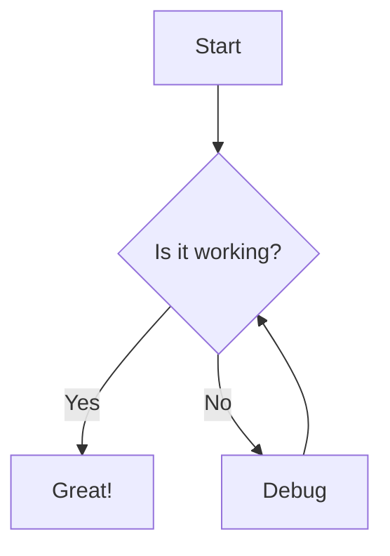
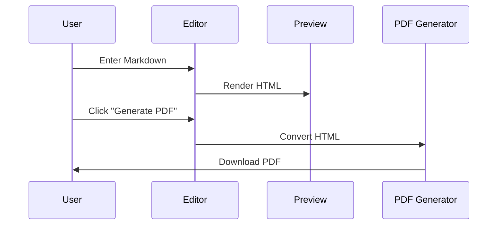
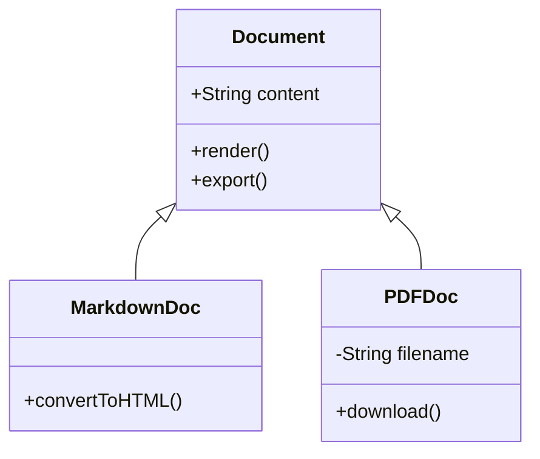
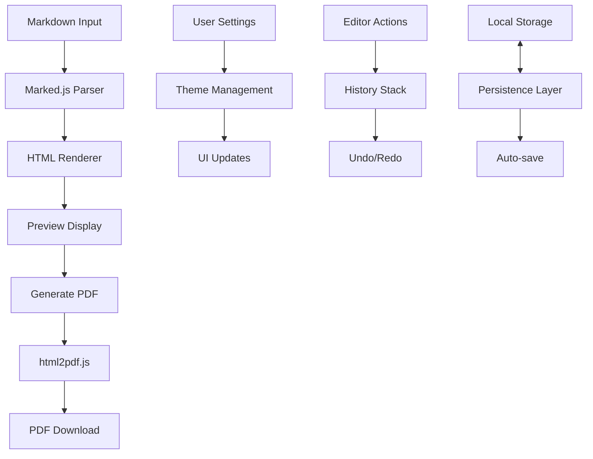

# Markdown to PDF Converter 🚀

> Transform your Markdown content into beautifully formatted PDFs with a single click.

[](https://opensource.org/licenses/MIT)
[](https://github.com/BrosG/markdown-to-pdf)

## 📋 Overview

**Markdown to PDF Converter** is a lightweight, browser-based tool that converts Markdown content into professionally styled PDF documents. Perfect for creating documentation, reports, articles, or any content that needs to be shared in a polished, platform-independent format.

## ✨ Key Features

- 🔄 **Real-time Preview** - See your changes rendered instantly
- 🌓 **Dark Mode Support** - Toggle between light and dark themes
- 📊 **Mermaid Diagrams** - Create and render flowcharts, sequence diagrams, and more
- 📱 **Fully Responsive** - Works on desktops, tablets, and mobile devices
- 💾 **Auto-Save** - Never lose your work with automatic local storage backup
- 🔙 **Undo/Redo** - Full history management with keyboard shortcuts
- 🛠️ **Customization Options** - Page size, orientation, and margins for PDF export
- 🧩 **Formatting Toolbar** - Quick access to common Markdown formatting options
- 📤 **Import/Export** - Drag-and-drop file imports and one-click exports
- 🔒 **Privacy-First** - All processing happens in your browser with no server uploads

## 🛠️ Quick Start

### Option 1: Use the Online Version

Visit [mark2pdf.com](https://mark2pdf.com) to use the tool immediately without installation.

### Option 2: Self-Host

1. **Download the HTML file**

   Download the `markdown2pdf.html` file from the repository.

2. **Open in Browser**

   Simply open the file in any modern web browser.

3. **Start Converting**

   Begin writing or pasting your Markdown and generate PDFs with a click.

## 📝 Markdown Features Showcase

### Text Formatting

Regular paragraphs are rendered with appropriate spacing.

**Bold text** is created with double asterisks.

*Italic text* uses single asterisks.

***Bold and italic*** can be combined.

### Lists

Unordered lists:
- Item 1
- Item 2
  - Nested item
  - Another nested item
- Item 3

Ordered lists:
1. First step
2. Second step
3. Third step

### Blockquotes

> Blockquotes are created with the greater-than symbol.
>
> Multi-paragraph quotes look like this.

### Code Blocks

Inline code: `console.log('Hello World');`

```javascript
// Syntax highlighted code blocks
function greet(name) {
  return `Hello, ${name}!`;
}

console.log(greet('Markdown'));
```

## 📊 Diagram Support

### Flow Charts



### Sequence Diagrams



### Class Diagrams



## ⌨️ Keyboard Shortcuts

| Shortcut | Action |
|----------|--------|
| `Ctrl` + `B` | Bold text |
| `Ctrl` + `I` | Italic text |
| `Ctrl` + `K` | Insert link |
| `Ctrl` + `H` | Toggle heading |
| `Ctrl` + `U` | Unordered list |
| `Ctrl` + `O` | Ordered list |
| `Ctrl` + `Q` | Blockquote |
| `Ctrl` + `Shift` + `C` | Code block |
| `Ctrl` + `S` | Save Markdown |
| `Ctrl` + `P` | Generate PDF |
| `Ctrl` + `Z` | Undo |
| `Ctrl` + `Y` | Redo |

## 📋 PDF Export Options

| Option | Description |
|--------|-------------|
| File name | Customize the output file name |
| Page size | Choose from A4, Letter, Legal |
| Orientation | Portrait or Landscape |
| Margins | Set custom margins in millimeters |

## 🧪 Technical Architecture



## 🌐 Browser Compatibility

| Browser | Minimum Version | Status |
|---------|-----------------|--------|
| Chrome | 60+ | ✅ Full support |
| Firefox | 60+ | ✅ Full support |
| Safari | 12+ | ✅ Full support |
| Edge | 79+ | ✅ Full support |
| Opera | 60+ | ✅ Full support |
| IE | Any | ❌ Not supported |

## 📊 Sample Document

### Project Status Report

| Task | Status | Completion |
|------|--------|------------|
| Design | ✅ Complete | 100% |
| Frontend | ⏳ In Progress | 65% |
| Backend | ⏳ In Progress | 80% |
| Testing | 🔜 Planned | 0% |
| Deployment | 🔜 Planned | 0% |

## 💼 Business Use Cases

- 📄 Technical documentation
- 📝 Meeting notes & minutes
- 📑 Project reports & status updates
- 📊 Data analysis summaries
- 🎓 Academic papers & assignments
- 📰 Newsletters & articles

## 🤝 Contributing

Contributions are welcome! Here's how you can help:

1. Fork the repository
2. Create your feature branch: `git checkout -b feature/amazing-feature`
3. Commit your changes: `git commit -m 'Add some amazing feature'`
4. Push to the branch: `git push origin feature/amazing-feature`
5. Open a Pull Request

## 📬 Contact

- **Email**: [gauthier.bros@gmail.com](mailto:gauthier.bros@gmail.com)
- **Website**: [bros.ai](https://bros.ai)
- **GitHub**: [BrosG](https://github.com/BrosG)

## 📄 License

This project is licensed under the MIT License - see the LICENSE file for details.

---

<p align="center">Made with ❤️ by <a href="https://bros.ai">Gauthier Bros</a></p>
